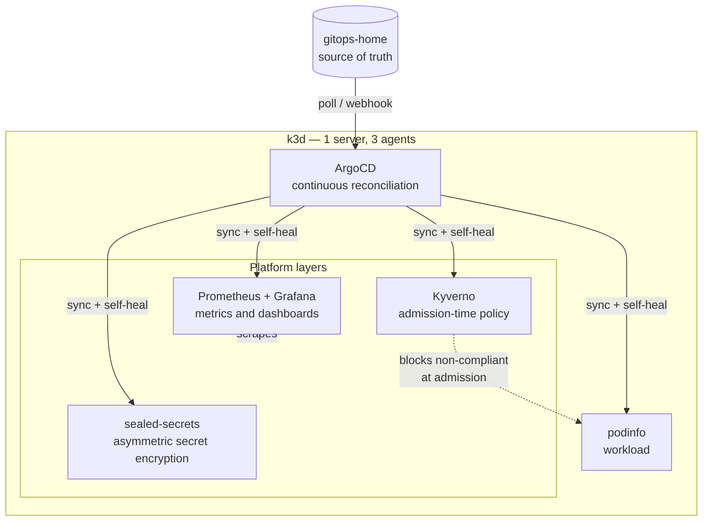

# gitops-home

A local Kubernetes platform managed declaratively with ArgoCD. Everything after the
cluster itself is installed by committing to this repository — no `helm install`, no
`kubectl apply` for workloads. Destroy the cluster, point ArgoCD back at this repo, and
the platform rebuilds.



## Stack

| Layer | Component | Purpose |
|---|---|---|
| Cluster | k3d / k3s | 4-node local Kubernetes, persistent across restarts |
| Delivery | ArgoCD | Reconciles cluster state to this repo continuously |
| Secrets | sealed-secrets | Encrypted credentials committed to a public repo |
| Policy | Kyverno | Admission-time enforcement of resource standards |
| Observability | kube-prometheus-stack | Metrics, dashboards, alerting |
| Workload | podinfo | Test application |

## Layout

```
├── argocd-app.yaml                 # podinfo Application
├── apps/podinfo/
│   ├── deployment.yaml
│   ├── service.yaml
│   └── sealed-secret.yaml          # ciphertext — safe to commit
├── infrastructure/
│   ├── sealed-secrets.yaml
│   ├── kyverno.yaml
│   └── monitoring.yaml
└── policies/
    └── require-resources.yaml
```

## Bootstrap

Create the cluster and install ArgoCD — the only imperative steps:

```bash
k3d cluster create home --servers 1 --agents 3 -p "8080:80@loadbalancer"

kubectl create namespace argocd
kubectl apply -n argocd --server-side \
  -f https://raw.githubusercontent.com/argoproj/argo-cd/stable/manifests/install.yaml
kubectl -n argocd rollout status deployment/argocd-server --timeout=300s
```

`--server-side` is required — client-side apply fails on the ApplicationSet CRD with
`metadata.annotations: Too long`.

Then hand the platform to ArgoCD:

```bash
kubectl apply -f argocd-app.yaml
kubectl apply -f infrastructure/
kubectl apply -f policies/
kubectl get application -n argocd
```

## What each layer demonstrates

### GitOps — reconciliation, not deployment

`syncPolicy.automated` with `selfHeal: true` means the cluster converges on this repo
continuously, not on the last command someone ran. Delete a managed deployment by hand
and ArgoCD restores it. Change `replicas` in a manifest, commit, and the cluster
follows without anyone running a scale command.

`prune: true` completes the loop — removing a manifest from git removes the resource
from the cluster. Git is the only lever, which means infrastructure changes carry
history, review, and `git revert` as a rollback mechanism.

### Sealed secrets — credentials in a public repo

Kubernetes Secrets are base64-encoded, not encrypted; committing one publishes it.
sealed-secrets solves this with asymmetric crypto: a controller in the cluster holds a
private key, `kubeseal` encrypts against the public key, and the resulting SealedSecret
is decryptable **only by that cluster**. The ciphertext is safe in a public repo.

```bash
kubectl create secret generic podinfo-creds \
  --from-literal=api-key=<value> --dry-run=client -o yaml > /tmp/raw.yaml

kubeseal --format yaml \
  --controller-name sealed-secrets --controller-namespace kube-system \
  < /tmp/raw.yaml > apps/podinfo/sealed-secret.yaml

wc -c apps/podinfo/sealed-secret.yaml   # verify non-zero before committing
rm /tmp/raw.yaml
```

The alternative is external-secrets, which leaves values in Vault or AWS Secrets Manager
and syncs a reference. The choice is whether the secret should exist in git at all.

### Kyverno — governance at the gate

Kubernetes reconciles *runtime state*. It has no opinion about what should be allowed to
exist. Kyverno is an admission controller: policies are evaluated by the API server
before a resource is persisted.

`policies/require-resources.yaml` requires every pod in `default` to declare CPU and
memory limits. A non-compliant pod is rejected outright:

```
$ kubectl run nolimits --image=nginx
Error from server: admission webhook "validate.kyverno.svc-fail" denied the request:
resource Pod/default/nolimits was blocked due to the following policies
require-resource-limits:
  check-limits: 'validation error: Every container must set CPU and memory limits.'
```

Two distinct control points: ArgoCD reconciles continuously toward a declaration;
Kyverno decides what is permitted to be declared.

Policies support `validationFailureAction: Audit`, which reports violations without
blocking — the path for introducing policy to a cluster that is already running.

### Observability

kube-prometheus-stack deployed as an ArgoCD Application, so monitoring is declarative
like everything else. Grafana reads live cluster metrics across every namespace the
platform runs in.

```bash
kubectl -n monitoring port-forward svc/kps-grafana 3000:80
```

## Source-type indifference

ArgoCD manages three different source types identically:

- **Helm chart repository** — Kyverno (`kyverno.github.io/kyverno`), monitoring
  (`prometheus-community.github.io/helm-charts`)
- **Git path in a third-party repo** — sealed-secrets
  (`github.com/bitnami-labs/sealed-secrets`, path `helm/sealed-secrets`)
- **This repository** — podinfo (`apps/podinfo`)

It doesn't care where desired state lives, only that it is declared.

## Debugging ArgoCD

`kubectl get application` reports status but not cause. The explanation is in the
conditions:

```bash
kubectl -n argocd get application <name> -o jsonpath='{.status.conditions}' ; echo
kubectl -n argocd get application <name> -o jsonpath='{.status.operationState.message}' ; echo
kubectl -n argocd get application <name> -o jsonpath='{.status.sync.revision}' ; echo
```

Same relationship as `kubectl describe pod` and its Events — status holds the verdict,
conditions hold the reason.

ArgoCD polls roughly every three minutes. To force a sync:

```bash
kubectl -n argocd patch application <name> --type merge \
  -p '{"metadata":{"annotations":{"argocd.argoproj.io/refresh":"hard"}}}'
```

Production setups wire a repository webhook so pushes sync immediately; polling is the
fallback, not the mechanism.

## Notes from the build

- **Branch mismatch is silent.** An Application targeting `main` against a repo on
  `master` shows blank sync status and creates nothing.
- **`targetRevision` is required for Helm sources**, and `destination` is required
  always. Omitting either produces a spec validation error rather than a sync failure.
- **Chart repositories disappear.** The sealed-secrets Helm index at
  `bitnami-labs.github.io` returns 404; the git source works.
- **kubeseal's default controller name** is `sealed-secrets-controller`; the Helm chart
  names the service `sealed-secrets`. Pass `--controller-name` explicitly.
- **Shell redirection creates the file before the command runs.** When `kubeseal`
  failed, it left a zero-byte `sealed-secret.yaml`. Git committed it, ArgoCD synced it,
  and every layer reported success on empty input while nothing existed. Check `wc -c`
  after any redirect that matters — silent success is worse than a loud failure.

## Operating

```bash
k3d cluster stop home     # park, state preserved
k3d cluster start home    # resume
```

Runs locally at no cost.
