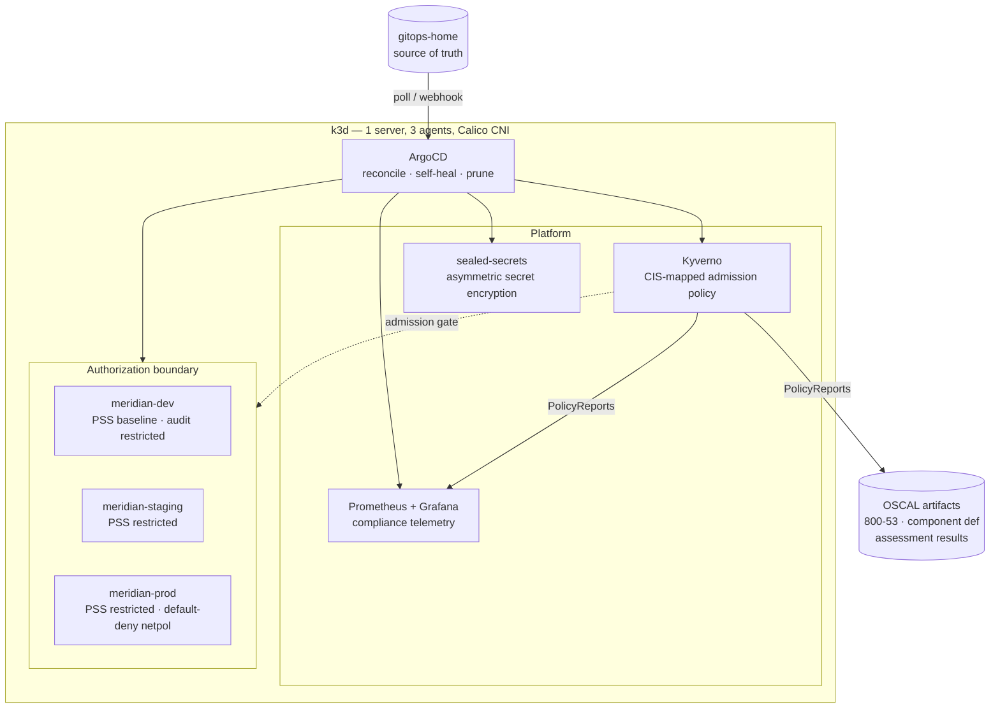

# gitops-home

A Kubernetes platform managed declaratively with ArgoCD, with compliance implemented
as code: CIS-mapped admission policies, enforced network segmentation, sealed secrets,
live control telemetry, and machine-readable NIST 800-53 artifacts generated from the
cluster's own state.

Everything after the cluster itself is installed by committing to this repository.
Destroy the cluster, point ArgoCD back here, and the platform rebuilds — which is how
it was rebuilt mid-build when the CNI had to be replaced.



## What this demonstrates

| Layer | Implementation |
|---|---|
| Delivery | ArgoCD — automated sync, self-heal, prune. Git is the only lever. |
| Boundary | Three environments, Pod Security Standards graded dev → prod at the namespace level |
| Segmentation | Calico enforcing default-deny NetworkPolicy, verified by connection test |
| Workload | Three-tier app, `restricted`-compliant by construction, sealed credentials |
| Policy | Seven CIS-mapped Kyverno policies, enforcing in scope, reporting elsewhere |
| Governance | Exception register with compensating controls; unassessed controls tracked as POA&M |
| Scanning | kube-bench (CIS 1–4), Kubescape (NSA-CISA, CIS) |
| Evidence | Live per-control compliance dashboard; OSCAL assessment results generated from cluster state |

## Layout

```
├── platform/              # namespaces, RBAC, baseline network policies
├── meridian/prod/         # three-tier workload + tier-scoped network policies
├── infrastructure/        # kyverno, sealed-secrets, monitoring (ArgoCD Applications)
├── policies/
│   ├── cis/               # CIS-mapped ClusterPolicies with control annotations
│   └── EXCEPTIONS.md      # exception register, POA&M, remediated findings
├── monitoring/            # ServiceMonitor + compliance dashboard
├── apps/podinfo/          # reference workload
└── oscal/
    ├── catalogs/          # NIST SP 800-53 Rev 5.2.0 (full catalog, 10MB)
    ├── profiles/          # Moderate impact baseline
    ├── component-definitions/   # what this platform implements, per control
    └── assessment-results/      # generated from live PolicyReports
```

---

## Compliance as code

### Policies carry their control mapping

Every ClusterPolicy is annotated with the control it implements. That annotation is
what separates a rule from evidence:

```yaml
metadata:
  name: cis-5-2-5-disallow-privilege-escalation
  annotations:
    compliance.meridian/cis-control: "5.2.5"
    compliance.meridian/nist-800-53: "AC-6(10)"
    compliance.meridian/pss-profile: "restricted"
```

The rejection message carries it through to the operator:

```
Error from server: admission webhook "validate.kyverno.svc-fail" denied the request:

resource Pod/meridian-dev/enforce-test was blocked due to the following policies

cis-5-2-5-disallow-privilege-escalation:
  check-allow-privilege-escalation: 'validation error: allowPrivilegeEscalation must
    be set to false. [CIS 5.2.5 / NIST AC-6(10)]'
```

### Audit before enforce

Policies were deployed in `Audit` mode first to establish a baseline against a running
cluster. That baseline showed the finding that shapes the whole design: **the
infrastructure components required to run and secure the cluster are the least
compliant workloads on it.** Calico's node agent needs host networking and NET_ADMIN.
Node exporter needs host PID and read-only host mounts. The service load balancer binds
host ports.

`restricted` cannot be enforced cluster-wide without breaking the cluster. The answer is
scoped enforcement plus documented exceptions — which is what
[`policies/EXCEPTIONS.md`](policies/EXCEPTIONS.md) is.

Enforcement applies to `meridian-*`. Everything else is evaluated and reported.

### Exceptions, not suppressions

Each exception names the component, the failing controls, the operational justification,
the compensating controls, and the residual risk. Unassessed controls are tracked
separately and explicitly **not** claimed as satisfied.

> An exception with no compensating control is a finding, not an exception.

### Findings get remediated through git

| Finding | Control | Fix |
|---|---|---|
| Unqualified image reference | CIS 5.1.4 / NIST CM-11 | Fully-qualified registry in the manifest |
| Plaintext DB password in manifest | Kubescape C-0012 / NIST IA-5 | Sealed secret |
| `runAsNonRoot` without explicit UID | Kubescape C-0013 / NIST AC-6 | Explicit `runAsUser` at pod and container level |
| Unused ServiceAccount tokens mounted | Kubescape C-0034 / NIST AC-6 | `automountServiceAccountToken: false` |

Kubescape NSA-CISA score moved 71.86% → 78.97%, zero Critical, zero High. The remaining
gap is exceptions and unassessed controls, all documented.

The remediation loop: policy detects → finding names the control and the failing path →
fix is committed → ArgoCD applies → report re-evaluates. No console, no ticket, no
manual verification.

---

## OSCAL — machine-readable compliance

NIST publishes 800-53 as structured data. There is no reason to transcribe it.

```bash
trestle import -f NIST_SP-800-53_rev5_catalog.json -o nist-800-53-rev5
trestle import -f NIST_SP-800-53_rev5_MODERATE-baseline_profile.json -o nist-800-53-moderate
```

Twenty control families, queryable:

```python
c = json.load(open('catalogs/nist-800-53-rev5/catalog.json'))['catalog']
# AC Access Control — 25 controls
# AU Audit and Accountability — 16 controls
# CM Configuration Management — 14 controls
```

### Component definition

[`oscal/component-definitions/meridian-platform/`](oscal/component-definitions/meridian-platform/)
declares what each platform component implements:

| Component | Controls |
|---|---|
| Kyverno Policy Engine | AC-6, AC-6(10), CM-7, CM-11, SA-12, SC-7, SI-3 |
| Calico Network Policy | AC-4, SC-7 |
| Sealed Secrets | IA-5, SC-28 |
| ArgoCD GitOps | CM-2, CM-3, CM-6 |
| Prometheus / Grafana | AU-6, CA-7, SI-4 |

Each implementation statement names the specific mechanism, not a paraphrase of the
control. Validated against OSCAL 1.2.1.

### Assessment results generated from the cluster

[`oscal/assessment-results/`](oscal/assessment-results/) is produced by reading live
`PolicyReport` resources and mapping policy outcomes to controls — **732 observations,
7 control findings, no manual assessment**. A finding is `satisfied` only when there are
zero failures *within the authorization boundary*; failures outside it resolve to the
exception register.

That is the loop closed: NIST defines the control → the component definition claims
implementation → Kyverno enforces at admission → PolicyReports record every evaluation
→ assessment results are generated in the format an assessor's tooling consumes.

---

## Verification

Segmentation is claimed and tested. A NetworkPolicy drop is silent — the connection
hangs rather than refusing — so an immediate `Connection refused` means the policy is
**not** being enforced.

```bash
# permitted: web tier → API tier
kubectl exec -n meridian-prod deploy/meridian-frontend -- wget -qO- http://meridian-api/healthz
# {"status": "OK"}

# denied: web tier → data tier (hangs until killed)
kubectl exec -n meridian-prod deploy/meridian-frontend -- timeout 6 nc -zv meridian-db 5432
# exit 143

# denied: cross-namespace
kubectl run xns -n meridian-dev --image=busybox:1.28 --rm -it -- \
  wget -qO- --timeout=6 http://meridian-api.meridian-prod
# wget: download timed out
```

This test caught a real finding mid-build: **k3s ships flannel, which does not enforce
NetworkPolicy.** The policy objects existed and were correctly specified. A document
review would have passed. The technical test failed. The cluster was rebuilt with
Calico — and rebuilt entirely from this repository, which is what GitOps is for.

Pod Security Standards enforce independently of Kyverno, at the API server:

```bash
kubectl run pss-test --image=nginx -n meridian-prod
# Error from server (Forbidden): violates PodSecurity "restricted:latest":
#   allowPrivilegeEscalation != false, unrestricted capabilities,
#   runAsNonRoot != true, seccompProfile
```

Two control points, deliberately. PSS is built into the API server and cannot be
bypassed. Kyverno adds control traceability and rules PSS does not cover.

---

## Operating

```bash
k3d cluster start home     # resume, state intact
k3d cluster stop home      # park

kubectl get application -n argocd
kubectl get policyreport -A
kubescape scan framework nsa --include-namespaces meridian-prod
```

Grafana → **Meridian — Compliance Posture**:

```bash
kubectl -n monitoring port-forward svc/kps-grafana 3000:80
```

Runs locally at no cost.

---

## Notes from the build

- **NetworkPolicy without an enforcing CNI is a document, not a control.** Test the
  denial path; a hang means enforcement, an immediate refusal means none.
- **Sealed secrets are bound to the cluster that sealed them.** Rebuilding the cluster
  generated a new keypair and the existing ciphertext became undecryptable — the
  security property working as designed, and an operational constraint. Production
  answers: back up the controller key, share a key across a fleet, or use
  external-secrets so the value never lives in git.
- **A ServiceMonitor with a wrong port name produces no target and no error.**
  Prometheus does not complain about a selector matching nothing; it silently scrapes
  nothing.
- **Shell redirection creates the file before the command runs.** A failed `kubeseal`
  left a zero-byte manifest. Git committed it, ArgoCD synced it, and every layer
  reported success on empty input. Check `wc -c` after any redirect that matters.
- **Cumulative counters are not current posture.** `kyverno_policy_results_total` counts
  every evaluation since controller start; a remediated resource still contributes its
  historical failures. For point-in-time state, read PolicyReports.
- **Two tools can disagree about one control.** Kyverno accepted `runAsNonRoot: true`;
  Kubescape wanted an explicit non-zero `runAsUser`. Both are defensible readings.
  Frameworks specify outcomes, not Kubernetes implementations — the mapping is
  interpretive, which is exactly why the reasoning has to be documented.
